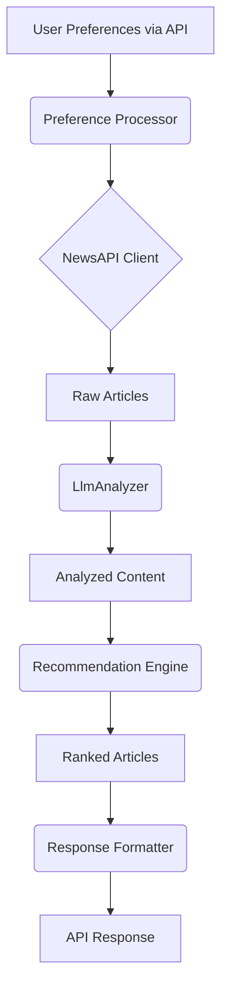

# AI News Recommendation System

## Overview

This project provides a personalized news recommendation service. It fetches articles from NewsAPI based on user preferences, analyzes them using an LLM (like OpenAI's GPT models) for summaries and keywords, scores them for relevance, and serves the recommendations via a REST API built with FastAPI.

## Features

-   **Personalized Recommendations:** Tailors news suggestions based on user-defined categories, keywords, and sources.
-   **AI-Powered Analysis:** Leverages Large Language Models (LLMs) for article summarization, keyword extraction, sentiment analysis, and categorization.
-   **Flexible Configuration:** Allows customization of API keys, LLM models, caching behavior, and recommendation parameters.
-   **RESTful API:** Exposes endpoints for easy integration with other applications.
-   **Caching:** Implements caching for NewsAPI responses and LLM analysis results to improve performance and reduce costs.
-   **Dockerized:** Includes Dockerfile and docker-compose setup for easy deployment.
-   **Tested:** Contains unit and integration tests for core components.

## System Architecture



## Project Structure

```
.
├── api/                 # FastAPI application, endpoints, and API models
├── analysis/            # LLM content analysis logic (summarization, keywords)
├── configuration/       # Configuration loading (dotenv)
├── fetchers/            # News API client and data fetching logic
├── processing/          # User preference validation and transformation
├── recommendations/     # Article scoring and ranking engine
├── responses/           # API response formatting logic
├── tests/               # Unit and integration tests
├── .env.example         # Example environment file
├── .gitignore           # Git ignore rules
├── Dockerfile           # Docker build instructions
├── docker-compose.yml   # Docker Compose service definitions
├── manual_test.py       # Script for manual end-to-end testing
├── README.md            # This file
├── requirements.txt     # Python dependencies
└── todo.md              # Project tasks (if used)
```

## Installation

1.  **Clone the repository:**
    ```bash
    git clone https://github.com/mohamedamineelabidi/ai-news-agent.git
    cd ai-news-agent
    ```
2.  **Create and activate a virtual environment (recommended):**
    ```bash
    python -m venv venv
    # On Windows
    .\venv\Scripts\activate
    # On macOS/Linux
    source venv/bin/activate
    ```
3.  **Install dependencies:**
    ```bash
    pip install -r requirements.txt
    ```
4.  **Configure environment variables:**
    -   Copy `.env.example` to `.env`:
        ```bash
        cp .env.example .env
        ```
    -   Edit `.env` and add your actual API keys:
        ```ini
        NEWSAPI_KEY=YOUR_NEWSAPI_KEY_HERE
        OPENAI_API_KEY=YOUR_OPENAI_API_KEY_HERE
        # Optional: Specify OpenAI model (defaults to gpt-3.5-turbo)
        # OPENAI_MODEL=gpt-4
        ```

## Running the Application

### Using Uvicorn (Development)

Run the FastAPI application directly using Uvicorn:

```bash
uvicorn api.main:app --reload --host 0.0.0.0 --port 8000
```

The API will be available at `http://localhost:8000`. The `--reload` flag enables auto-reloading on code changes.

### Using Docker

Build and run the application using Docker Compose:

```bash
docker-compose up --build
```

This will build the Docker image (if necessary) and start the service defined in `docker-compose.yml`. The API will be available at `http://localhost:8000`.

To run in detached mode:
```bash
docker-compose up -d --build
```

To stop the services:
```bash
docker-compose down
```

## Running Tests

Execute the test suite using `pytest`:

```bash
pytest
```

Ensure your environment variables (`.env`) are set up, as some integration tests might require API keys.

## API Integration Guide

### Base URL

`http://localhost:8000/api/v1` (when running locally or via Docker default)

### Endpoints

#### Get Recommendations

-   **Endpoint:** `POST /recommendations`
-   **Description:** Fetches, analyzes, and ranks news articles based on provided user preferences.
-   **Authentication:** Requires `X-API-Key` header.
-   **Request Body:**
    ```json
    {
      "user_id": "user_123",
      "preferred_categories": ["technology", "science"],
      "keywords": ["AI", "machine learning"],
      "sources": ["techcrunch", "wired"], // Optional: Filter by specific sources
      "excluded_sources": ["dailymail"], // Optional: Exclude specific sources
      "language": "en", // Optional: Defaults to 'en'
      "max_articles": 10 // Optional: Max articles to return
    }
    ```
-   **Successful Response (200 OK):**
    ```json
    {
      "user_id": "user_123",
      "recommendations": [
        {
          "title": "AI Breakthrough in Healthcare",
          "url": "https://example.com/article1",
          "source": "TechCrunch",
          "summary": "New AI system achieves 98% accuracy in diagnosing rare diseases from medical scans.",
          "keywords": ["AI", "healthcare", "machine learning", "diagnosis", "medical scans"],
          "sentiment": "positive", // Example, if implemented
          "category": "technology", // Example, if implemented
          "relevance_score": 4.8
        }
        // ... other recommendations
      ],
      "analysis_metadata": {
        "processing_time_seconds": 1.23,
        "llm_model_used": "gpt-3.5-turbo",
        "articles_fetched": 20,
        "articles_analyzed": 5
      }
    }
    ```

#### Health Check

-   **Endpoint:** `GET /health`
-   **Description:** Provides a simple health check endpoint to verify the API is running.
-   **Authentication:** None required.
-   **Successful Response (200 OK):**
    ```json
    {
      "status": "OK",
      "version": "1.0.0", // Replace with dynamic version if available
      "timestamp": "2025-04-24T01:35:00Z"
    }
    ```

### Authentication

Include your assigned API key in the `X-API-Key` header for all authenticated requests (currently `/recommendations`).

```http
X-API-Key: YOUR_SECRET_API_KEY
```

### Client Example (Python)

```python
import requests
import json

API_BASE_URL = "http://localhost:8000/api/v1"
API_KEY = "YOUR_SECRET_API_KEY" # Replace with your actual key

preferences = {
    "user_id": "client_app_456",
    "preferred_categories": ["technology", "business"],
    "keywords": ["generative AI", "startup funding"],
    "max_articles": 5
}

headers = {
    "X-API-Key": API_KEY,
    "Content-Type": "application/json"
}

try:
    response = requests.post(
        f"{API_BASE_URL}/recommendations",
        headers=headers,
        json=preferences,
        timeout=30 # Set a reasonable timeout
    )

    response.raise_for_status() # Raise an exception for bad status codes (4xx or 5xx)

    recommendations_data = response.json()
    print(f"Successfully received recommendations for user: {recommendations_data.get('user_id')}")
    print(json.dumps(recommendations_data.get('recommendations', []), indent=2))

except requests.exceptions.RequestException as e:
    print(f"API request failed: {e}")
    if e.response is not None:
        print(f"Status Code: {e.response.status_code}")
        try:
            print(f"Response Body: {e.response.json()}")
        except json.JSONDecodeError:
            print(f"Response Body: {e.response.text}")

```

### Error Handling

The API uses standard HTTP status codes. Common errors include:

-   `401 Unauthorized`: Missing or invalid `X-API-Key`.
-   `422 Unprocessable Entity`: Invalid request body (e.g., missing required fields, incorrect data types). The response body will contain details about the validation errors.
-   `500 Internal Server Error`: An unexpected error occurred on the server.

Example Error Response (`401 Unauthorized`):
```json
{
  "detail": "Not authenticated"
}
```

Example Error Response (`422 Unprocessable Entity`):
```json
{
  "detail": [
    {
      "loc": [
        "body",
        "preferred_categories"
      ],
      "msg": "field required",
      "type": "value_error.missing"
    }
  ]
}
```

## Key Components Deep Dive

*   **Preference Processor (`processing/preference_processor.py`):** Validates incoming user preferences against Pydantic models and transforms them into structured query parameters suitable for the NewsAPI client.
*   **NewsAPI Client (`fetchers/newsapi_client.py`):** Interacts with the external NewsAPI. Handles request construction, sending requests, and basic response parsing. Includes caching to avoid redundant API calls.
*   **LLM Analyzer (`analysis/llm_analyzer.py`):** Communicates with the configured OpenAI model. Takes article text and performs analysis tasks (summarization, keyword extraction). Implements caching for LLM results based on text content to save costs and improve speed.
*   **Recommendation Engine (`recommendations/engine.py`):** Takes analyzed articles and user preferences to calculate a relevance score for each article. Uses factors like keyword overlap, category match, and potentially source reputation or recency. Ranks articles based on this score.
*   **Response Formatter (`responses/formatter.py`):** Structures the final ranked and analyzed articles into the defined API response format using Pydantic models.

## Configuration Details

Environment variables are loaded from the `.env` file using `python-dotenv`. Key variables:

*   `NEWSAPI_KEY`: **Required**. Your key for accessing NewsAPI.
*   `OPENAI_API_KEY`: **Required**. Your key for accessing OpenAI API.
*   `OPENAI_MODEL`: *Optional*. The specific OpenAI model to use (e.g., `gpt-3.5-turbo`, `gpt-4`). Defaults to `gpt-3.5-turbo`.
*   `LOG_LEVEL`: *Optional*. Set the logging level (e.g., `INFO`, `DEBUG`). Defaults to `INFO`.

## Troubleshooting

*   **`ModuleNotFoundError`:** Ensure you have activated your virtual environment (`source venv/bin/activate` or `.\venv\Scripts\activate`) and installed dependencies (`pip install -r requirements.txt`).
*   **API Key Errors:** Double-check that your `.env` file exists in the project root, contains the correct keys (`NEWSAPI_KEY`, `OPENAI_API_KEY`), and has no typos. Ensure the keys are valid and have the necessary permissions/quota.
*   **NewsAPI `429 Too Many Requests`:** You might be exceeding the rate limits of your NewsAPI plan (especially the free tier). Consider adding delays or upgrading your plan if needed. The client has basic caching which helps.
*   **OpenAI Errors:** Check your OpenAI API key validity and usage limits. Ensure the input text sent for analysis is within the model's context limits. Check OpenAI's status page for outages.
*   **Docker Issues:** Ensure Docker Desktop (or Docker Engine) is running. Check `docker-compose logs` for specific error messages from within the container.

## Contributing

Contributions are welcome! Please follow these steps:

1.  Fork the repository.
2.  Create a new branch for your feature or bug fix (`git checkout -b feature/your-feature-name`).
3.  Make your changes and add tests for them.
4.  Ensure all tests pass (`pytest`).
5.  Format your code using a tool like Black (optional but recommended).
6.  Commit your changes (`git commit -am 'Add some feature'`).
7.  Push to the branch (`git push origin feature/your-feature-name`).
8.  Create a new Pull Request.

## License

This project is licensed under the MIT License. See the LICENSE file for details (Note: You might need to create a LICENSE file if one doesn't exist).
